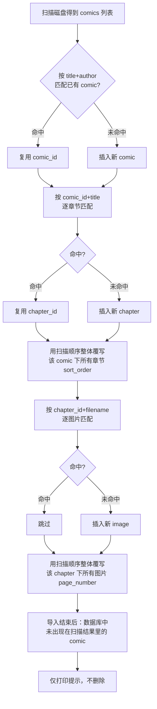

# 阅读记录、收藏与增量导入

## Summary

移除应用内删除漫画的能力，把"我的" tab 从接口调试面板改成"最近阅读"+"收藏"两个列表，新增阅读进度（精确到页）与收藏的持久化数据，并把后端导入流程从"每次清空重建"改为增量导入，使这些记录能跨重新扫描保留。

## Problem Frame

（详见 origin：`specs/changes/2026-08-08-reading-history-and-mine-tab/define.md` 的 Problem Frame）当前"我的" tab 是接口调试面板，没有阅读记录/收藏，且 `backend/src/db/init.ts` 每次导入都会清空重建三张核心表，导致任何以数据库 ID 为外键的新数据都无法跨重新导入存活。

## Key Technical Decisions

- **用现有的 `title`/`author`/`filename` 字段做增量匹配的自然键，不新增字段。** `comics` 加 `UNIQUE(title, author)`，`chapters` 加 `UNIQUE(comic_id, title)`，`images` 加 `UNIQUE(chapter_id, filename)`——这些字段本来就是从文件夹名解析出来的稳定值，不需要额外存一份"原始文件夹名"。代价记在下面的 Risks。
- **每次导入都重新核对已存在章节/图片的排序，不只处理新增内容。** 新章节插入到中间时，用扫描得到的顺序整体覆写该漫画下所有章节的 `sort_order`（图片的 `page_number` 同理），否则中间插入会打乱既有顺序。
- **"继续阅读"跳到具体页，靠估算滚动位置，不改造阅读器为翻页模式。** 用章节图片接口已经返回的 `width`/`height` 推算目标页在连续滚动列表中的偏移量，`jumpTo` 之后随着真实图片加载自我校正。阅读器交互增强不在这轮范围内。
- **阅读进度只在离开阅读器时写一次。** 不做阅读过程中的持续上报，减少请求量，也不需要防抖/节流逻辑。
- **漫画级的收藏/进度变更走 `comics` 资源路由，聚合列表走新的 `mine` 路由。** `PUT /api/comics/:id/progress`、`POST/DELETE /api/comics/:id/favorite` 沿用现有"对单个漫画操作"的路由风格；`GET /api/mine/recent`、`GET /api/mine/favorites` 是跨漫画的聚合查询，放在独立的 `mine.ts` 里。

## Requirements

以下需求承接自 origin 文档，按能力分组，R-ID 与 origin 保持一致。

**移除删除功能**

- R1. 漫画详情页不再提供删除入口。 → U6
- R2. 后端不再提供删除漫画的接口。 → U6

**"我的" tab 重做**

- R3. 现有的接口调试面板整体移除。 → U7
- R4. "我的" tab 展示"最近阅读"和"收藏"两个列表。 → U7
- R5. 点击"最近阅读"直接进入阅读器并定位到记录的章节和页码。 → U5, U7
- R6. 点击"收藏"进入该漫画的详情页。 → U7

**阅读进度与收藏**

- R7. 每本漫画只保留一条最新的阅读位置记录（章节 + 页码）。 → U1, U3, U5
- R8. 收藏是漫画级别的开关，不区分章节。 → U1, U3, U6

**导入流程增量化**

- R9. 重新导入时已存在的漫画/章节/图片的数据库 ID 保持不变。 → U1, U2
- R10. 只新增磁盘上新出现的内容，不重复插入已存在内容。 → U2
- R11. 磁盘上找不到对应文件夹的漫画只提示，不自动从数据库删除。 → U2

## High-Level Technical Design

增量导入的匹配/写入流程（`backend/src/scripts/seed.ts`）：



## Implementation Units

### U1. 数据库 schema：增量匹配约束 + 收藏/阅读进度表

**Status:** shipped — commit 1c3f983

- **Goal:** 让 `comics`/`chapters`/`images` 具备可用于增量匹配的唯一约束，并新增 `favorites`、`reading_progress` 两张表。
- **Requirements:** R7, R8, R9
- **Dependencies:** 无
- **Files:** `backend/src/db/schema.sql`, `backend/src/db/init.ts`
- **Approach:**
  - `schema.sql` 里给 `comics` 加 `UNIQUE KEY uq_comics_title_author (title, author)`，给 `chapters` 加 `UNIQUE KEY uq_chapters_comic_title (comic_id, title)`，给 `images` 加 `UNIQUE KEY uq_images_chapter_filename (chapter_id, filename)`。
  - 新增表：
    ```sql
    CREATE TABLE IF NOT EXISTS favorites (
      comic_id   INT UNSIGNED NOT NULL PRIMARY KEY,
      created_at DATETIME NOT NULL DEFAULT CURRENT_TIMESTAMP,
      CONSTRAINT fk_favorites_comic FOREIGN KEY (comic_id) REFERENCES comics(id) ON DELETE CASCADE
    ) ENGINE=InnoDB DEFAULT CHARSET=utf8mb4;

    CREATE TABLE IF NOT EXISTS reading_progress (
      comic_id    INT UNSIGNED NOT NULL PRIMARY KEY,
      chapter_id  INT UNSIGNED NOT NULL,
      page_number SMALLINT UNSIGNED NOT NULL DEFAULT 0,
      updated_at  DATETIME NOT NULL DEFAULT CURRENT_TIMESTAMP ON UPDATE CURRENT_TIMESTAMP,
      CONSTRAINT fk_progress_comic FOREIGN KEY (comic_id) REFERENCES comics(id) ON DELETE CASCADE,
      CONSTRAINT fk_progress_chapter FOREIGN KEY (chapter_id) REFERENCES chapters(id) ON DELETE CASCADE
    ) ENGINE=InnoDB DEFAULT CHARSET=utf8mb4;
    ```
    `comic_id` 作为 `reading_progress` 的主键，直接在 schema 层面保证"每本漫画只有一条最新记录"（R7）。
  - `init.ts` 目前用 `TRUNCATE` 三张表，需要整体去掉（R9 的直接实现）。`schema.sql` 是整份用 `conn.query(sql)` 执行的，`CREATE TABLE IF NOT EXISTS` 天然幂等，但新增的 `UNIQUE KEY`/`FOREIGN KEY` 约束对已存在的表不是幂等操作（重复执行会报"重复键名"）。`init.ts` 需要在执行 schema 前，对每条新增约束先查 `information_schema.STATISTICS`/`TABLE_CONSTRAINTS` 判断是否已存在，不存在才执行对应的 `ALTER TABLE ... ADD ...`，而不是把约束写死在 `schema.sql` 里重复执行。
- **Verification:** 对着已有真实数据库跑一次 `npm run setup`（不清空的版本，见 U2）不报错；再跑第二次同样不报错（约束/表已存在时不重复创建）。

### U2. 导入流程改为增量

**Status:** shipped — commit 37f278c

- **Goal:** `scan.ts`/`seed.ts` 按自然键匹配已有记录，只新增缺失内容，保持 ID 稳定；磁盘上消失的漫画只提示。
- **Requirements:** R9, R10, R11
- **Dependencies:** U1
- **Files:** `backend/src/scripts/seed.ts`
- **Approach:**
  - comic：按 `(title, author)` 查询 `comics`，命中则复用 `id`（可顺带更新 `cover_path` 为最新扫描到的封面），未命中则插入。
  - chapter：按 `(comic_id, title)` 查询 `chapters`，命中则复用 `id`，未命中则插入；处理完一个 comic 的全部章节后，用扫描顺序对该 comic 下**所有**章节批量更新 `sort_order`（覆盖已存在的，不只是新插入的）。
  - image：按 `(chapter_id, filename)` 查询 `images`，命中则跳过插入（保留已有的 `width`/`height`），未命中则插入；同样在处理完一个 chapter 的全部图片后，用扫描顺序批量更新该 chapter 下所有图片的 `page_number`。
  - 全部 comic 处理完后，查询数据库里全部 `comics.title`/`author`，与本次扫描结果做差集，对每个"数据库有、扫描没有"的 comic 打印一行提示（R11），不做任何删除操作。
- **Patterns to follow:** 现有 `seed.ts` 的分层遍历结构（comic → chapter → image）和 `progress()` 进度条输出保持不变，只替换插入逻辑为"查询命中则复用、否则插入"。
- **Verification:** 首次对现有磁盘目录跑一次导入后，记录若干 comic/chapter 的 id；新增一个漫画文件夹后再跑一次，确认原有 id 不变、新漫画被正确插入、章节顺序仍正确；临时改名/移走一个漫画文件夹后再跑一次，确认它仍在数据库里且扫描输出有提示。

### U3. 后端：阅读进度与收藏接口

**Status:** shipped — commit 4c8c19e

- **Goal:** 提供更新/查询阅读进度、切换收藏、聚合列出"最近阅读"与"收藏"的接口。
- **Requirements:** R5, R7, R8
- **Dependencies:** U1
- **Files:** `backend/src/routes/comics.ts`, `backend/src/routes/mine.ts`（新增）, `backend/src/routes/index.ts`
- **Approach:**
  - `comics.ts` 新增：
    - `PUT /api/comics/:id/progress`，body 为 `{ chapterId, pageNumber }`，对 `reading_progress` 做 upsert（`comic_id` 主键，存在则更新）。
    - `POST /api/comics/:id/favorite` 插入一行 `favorites`（已存在则忽略），`DELETE /api/comics/:id/favorite` 删除对应行。
    - `GET /api/comics/:id` 的返回顺带带上 `favorited: boolean`（用于详情页初始态），查询时 left join `favorites`。
  - 新增 `mine.ts`：
    - `GET /api/mine/recent`：`reading_progress` join `comics`/`chapters`，按 `updated_at` 倒序，返回每条记录的 comic 基本信息 + `chapterId`/`chapterTitle`/`pageNumber`。
    - `GET /api/mine/favorites`：`favorites` join `comics`（复用 `comics.ts` 里现有的 `comicQuery()` 聚合逻辑得到话数/图片数），按 `created_at` 倒序。
  - `routes/index.ts` 挂载 `router.use("/mine", mineRouter)`。
- **Patterns to follow:** 沿用 `backend/src/utils/response.ts` 的 `ok`/`fail` 包装和现有路由里 `try/catch` + `parseInt` 校验 `id` 的写法。
- **Verification:** 手动调用四个新接口，确认收藏切换后 `GET /api/mine/favorites` 立即反映变化；更新进度后 `GET /api/mine/recent` 返回最新的章节/页码而不是重复记录。

### U4. Flutter：新增 API 方法与模型

**Status:** shipped — commit c03ee1e

- **Goal:** `ApiService` 补齐调用 U3 四个接口的方法，并去掉 `deleteComic`。
- **Requirements:** R2, R5, R6, R7, R8
- **Dependencies:** U3
- **Files:** `lib/services/api.dart`, `lib/models/reading_progress_entry.dart`（新增）
- **Approach:**
  - 新增 `ReadingProgressEntry`（comic 信息 + `chapterId`/`chapterTitle`/`pageNumber`），供"最近阅读"列表使用；`收藏`列表直接复用现有 `Comic` 模型。
  - `ApiService` 新增 `updateProgress(comicId, chapterId, pageNumber)`、`setFavorite(comicId, bool favorited)`、`getRecent()`、`getFavorites()`。
  - 移除 `deleteComic` 方法（R2 在前端侧的对应清理）。
- **Verification:** 各方法能正确解析 U3 接口返回的 JSON 结构。

### U5. Flutter：阅读器记录进度 + 跳转到指定页

**Status:** shipped — commit c03ee1e

- **Goal:** `ReaderScreen` 离开时上报当前阅读位置；支持传入 `comicId` 和可选的初始页码，打开时跳转到该页。
- **Requirements:** R5, R7
- **Dependencies:** U4
- **Files:** `lib/screens/reader_screen.dart`, `lib/screens/detail_screen.dart`（传参调整）
- **Approach:**
  - `ReaderScreen` 增加 `comicId`（必填）和 `initialPage`（可选）两个参数；`detail_screen.dart` 里跳转到 `ReaderScreen` 的地方补上 `comicId`。
  - 用已有的 `_LazyImage` 可见性回调追踪"当前已看到的最大页码"；在 `dispose()`（或返回上一页时）调用 `ApiService.updateProgress`。
  - 初始跳转：图片列表本身已带 `width`/`height`（`ImageItem`），用视口宽度换算每张图片的预估显示高度，累加得到 `initialPage` 对应的预估滚动偏移量，加载完成后 `_scrollController.jumpTo(estimatedOffset)`；后续随真实图片加载，位置自然收敛，不需要额外校正逻辑。
- **Technical design:**（方向性示意，非最终实现）
  ```text
  estimatedOffset = sum(viewportWidth / image[i].width * image[i].height for i in 0..<initialPage)
  ```
- **Dependencies:** U4
- **Verification:** 打开一本漫画阅读到中途退出，"最近阅读"更新为该页；重新点击"最近阅读"能大致跳转到退出前的位置（允许因图片实际渲染高度产生的小幅偏差）。

### U6. Flutter：移除删除功能，加入收藏开关

**Status:** shipped — commit c03ee1e

- **Goal:** 详情页去掉删除按钮和确认对话框，原按钮位置改为收藏图标；后端去掉删除路由。
- **Requirements:** R1, R2, R8
- **Dependencies:** U4
- **Files:** `lib/screens/detail_screen.dart`, `backend/src/routes/comics.ts`
- **Approach:**
  - `detail_screen.dart`：删掉 `_delete()` 方法和对应的 `IconButton`；`AppBar.actions` 改为一个收藏图标按钮（已收藏/未收藏两种状态），点击调用 `ApiService.setFavorite` 并做本地状态切换。
  - `comics.ts`：删除 `DELETE /:id` 路由及其专用的 `getComicFolder` 辅助函数（确认不再被其他地方引用）。
- **Verification:** 详情页不再有删除入口；对已删除路由发起 `DELETE` 请求返回 404/无此路由；收藏图标点击后状态正确切换并持久化（刷新页面后状态保持）。

### U7. Flutter："我的" tab 重做

**Status:** shipped — commit c03ee1e

- **Goal:** `MineScreen` 从接口调试面板改为"最近阅读"+"收藏"两个列表。
- **Requirements:** R3, R4, R5, R6
- **Dependencies:** U4, U5, U6
- **Files:** `lib/screens/mine_screen.dart`
- **Approach:**
  - 移除现有全部调试面板内容（端点按钮、状态栏、响应展示）。
  - 用 `TabBar`/`TabBarView`（或等价的分段控件）承载两个列表：
    - "最近阅读"：调用 `ApiService.getRecent()`，每项展示封面/标题/`chapterTitle`+页码，点击直接 `Navigator.push` 到 `ReaderScreen`（带上记录的 `comicId`/`chapterId`/`initialPage`）。
    - "收藏"：调用 `ApiService.getFavorites()`，复用现有 `_ComicCard` 风格展示，点击进入 `DetailScreen`。
  - 两个列表都需要一个空态（暂无最近阅读/暂无收藏）。
- **Patterns to follow:** 列表项外观参考 `lib/screens/home_screen.dart` 里 `_ComicCard` 的卡片样式，保持视觉一致。
- **Verification:** 收藏/取消收藏后回到"我的"tab，收藏列表实时反映变化；阅读一本漫画后"最近阅读"出现对应条目并可点击继续阅读。

## Risks & Dependencies

- **`UNIQUE(title, author)` 迁移风险：** 如果当前生产数据库里已经存在标题+作者完全相同的两条 `comics` 记录，U1 的 `ALTER TABLE` 会直接报错而不是静默生效——这是安全的失败模式（不会破坏数据），但需要在真正执行迁移前，先用一条查询确认数据库里没有重复的 `(title, author)` 组合，若有则手动处理后再迁移。
- **滚动位置估算的精度：** U5 的跳转是估算值，长章节或图片宽高比差异很大时可能有明显偏差；这是本轮明确接受的取舍（阅读器交互增强本身不在范围内）。
- **`favorites`/`reading_progress` 依赖 U1 的表结构先落地：** U3/U4/U5/U6/U7 都间接依赖 U1，实施顺序上 U1、U2（数据库/导入）应先于前端相关单元。

## Spec Impact

- `specs/reading-history-and-favorites.spec.md`（新建）：记录阅读进度"每本漫画一条最新记录"的不变量、收藏是漫画级别开关、以及 `/api/comics/:id/progress`、`/api/comics/:id/favorite`、`/api/mine/recent`、`/api/mine/favorites` 的契约。
- `specs/import-pipeline.spec.md`（新建）：记录导入流程的增量匹配不变量（按 `title+author`/`comic_id+title`/`chapter_id+filename` 复用 ID、每次导入重新核对排序、磁盘消失的漫画只提示不删除）。
