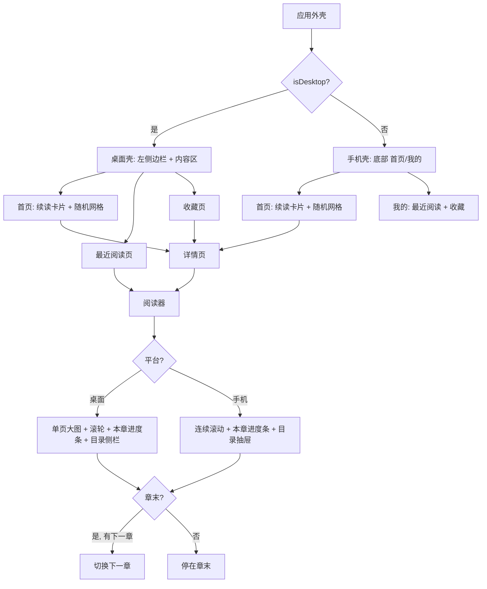

# 双端页面设计（桌面 / 手机）

## Summary

把漫画应用重构成桌面（Windows/浏览器）与手机两套体验：桌面用左侧边栏导航与单页大图滚轮阅读器，手机用底部"首页/我的"两个 tab 与连续滚动阅读器。两端首页都是"最近阅读卡片 + 全库随机网格"，阅读器带本章进度条、快速跳转、自动续章与目录，详情页双端适配并新增"继续阅读"。

---

## Problem Frame

当前应用只有一套面向手机竖屏的界面：底部三个 tab、固定宽度网格、阅读器仅竖向连续滚动，没有平台差异。桌面窗口与浏览器里内容利用率低，操作仍按触屏设计。库数据没有可靠排序依据，按标题排序的首页放大了这个问题。上一轮已落地"每本漫画一条阅读记录（章节 + 页码）"，但还没有任何页面把它用起来。

---

## Requirements

承接 origin 的 R-ID，按能力分组；括号内为对应的实现单元。

**双端框架**

- R1. 应用按运行平台提供桌面与手机两套界面，浏览器与 Windows 共用桌面形态。（U2）
- R2. 桌面导航为左侧边栏（首页/最近阅读/收藏）与顶栏搜索框；手机导航为底部"首页/我的"两个 tab。（U2, U8）
- R3. 移除原有"发现"页，随机展示能力并入首页。（U2, U3）

**首页**

- R4. 首页顶部展示"最近阅读"卡片，只显示最近读过的一本漫画，含封面与"第 X 话 · 第 Y 页"。（U3）
- R5. 点击"最近阅读"卡片直接进入阅读器并定位到记录的章节与页码。（U3, U4）
- R6. 首页主体为全部漫画的网格，默认随机顺序展示。（U1, U3）
- R7. 没有阅读记录时首页不显示"最近阅读"卡片。（U3）

**搜索**

- R8. 桌面版在顶栏提供常驻搜索框；手机版通过首页顶栏搜索图标进入全屏搜索页。（U3）

**阅读器（桌面）**

- R9. 桌面阅读器为单页大图模式，鼠标滚轮翻页。（U5）
- R10. 阅读器展示本章进度（第 N / M 页），提供可拖动跳转的进度条。（U5, U6）
- R11. 章节末尾自动进入下一章，并提供上一章/下一章按钮与章节目录入口。（U4, U5, U6）
- R12. 桌面章节目录以侧边面板呈现。（U5）

**阅读器（手机）**

- R13. 手机阅读器为竖向连续滚动。（U6）
- R14. 手机阅读器展示本章进度条并支持拖动快速跳转。（U6）
- R15. 手机阅读器章节末尾自动续章，目录以底部抽屉或全屏列表呈现。（U4, U6）

**阅读进度**

- R16. 阅读位置记录保持"每本漫画一条（章节 + 页码）"；离开阅读器时更新为最新位置，自动续章后同样更新。（U4）

**详情页**

- R17. 详情页保留封面、作者、收藏开关与章节列表。（U7）
- R18. 桌面详情页为"左侧信息 + 右侧章节列表"的并排布局；手机保持纵向布局。（U7）
- R19. 有阅读记录时详情页提供"继续阅读"按钮，点击进入阅读器并定位。（U1, U4, U7）

---

## Key Technical Decisions

- **平台判定集中在一处：** 应用外壳层计算 `isDesktop = kIsWeb || (Windows/Linux/macOS)`，据此选择导航与阅读器形态；页面内部不散落平台分支。
- **首页随机 = 全量一次加载，刷新即重排。** 当前库约 150 本，后端 `random=1` 时放开 pageSize 上限到 500，首页一次性取全库随机；分页随机留作大库演进，见 Scope Boundaries。
- **阅读器单组件双模式。** 同一个 ReaderScreen 按平台渲染"单页"或"连续滚动"两种主体，章节切换、目录、进度保存共用一套状态逻辑，避免两套数据流分叉。
- **阅读进度数据模型不变。** 沿用"每本漫画一条（章节 + 页码）"；本章进度条由当前章节图片列表长度推算，不新增后端字段。
- **自动续章是阅读器内章节上下文切换。** 章节列表已由详情接口返回，无需新后端契约；续章后当前章节与页码状态整体切换，离开时统一保存。
- **桌面侧栏页面复用手机"我的"的列表组件。** 把最近阅读/收藏列表抽成共享 widget，桌面侧栏与手机 tab 只是不同容器，数据和交互一致。

---

## High-Level Technical Design

应用外壳按平台分流，阅读器在壳内按平台选择主体形态：

随机书库与续读的数据来源：首页随机网格来自列表接口的 `random` 排序；续读卡片与详情页"继续阅读"按钮来自阅读记录（每本一条）。两者都依赖上一轮已落地的接口，本轮只给列表接口加 `random` 支持、给详情接口加 `progress` 字段。

---

## Implementation Units

### U1. 后端：列表随机排序 + 详情返回阅读进度

- **Goal:** 列表接口支持随机排序，详情接口返回该漫画的阅读进度，为首页随机网格与"继续阅读"提供数据。
- **Requirements:** R6, R19
- **Dependencies:** 无
- **Files:** `backend/src/routes/comics.ts`
- **Approach:**
  - 列表接口读取 `random` 查询参数：为 1 时用 `ORDER BY RAND()` 代替按标题排序，并把该请求的 pageSize 上限从 100 放宽到 500（非随机请求保持 100）；`random` 与 `keyword` 可同时使用。
  - 详情接口在返回 `favorited` 的同时返回 `progress`：查 `reading_progress`，存在则返回 `{ chapterId, pageNumber }`，不存在返回 `null`。
- **Patterns to follow:** 现有 `comicQuery()` 与 `ok`/`fail` 包装的写法（`backend/src/routes/comics.ts`）。
- **Verification:** 手动调用 `GET /api/comics?random=1&pageSize=500` 两次，顺序不同且返回全库；`GET /api/comics/:id` 在写入进度前后分别返回 `progress` 的 null 与具体值。

### U2. 应用外壳：平台识别 + 桌面侧边栏 / 手机两 tab

- **Goal:** 应用按平台选择导航骨架：桌面侧边栏 + 顶栏搜索，手机底部"首页/我的"两个 tab；移除"发现"tab。
- **Requirements:** R1, R2, R3
- **Dependencies:** 无
- **Files:** `lib/main.dart`, `lib/screens/random_screen.dart`（移除引用）
- **Approach:**
  - 在 `main.dart` 增加平台判定（Web 与 Windows/Linux/macOS 视为桌面，Android/iOS 视为手机）。
  - 手机壳改为两个 tab（首页/我的），移除"发现"入口；桌面壳为左侧边栏（首页/最近阅读/收藏）+ 内容区，内容区默认显示首页。
  - `random_screen.dart` 的随机能力由首页接管，该文件不再被引用。
- **Patterns to follow:** 现有 `MainShell` 的 `IndexedStack` + 底部导航结构。
- **Verification:** 桌面窗口与浏览器运行呈现侧边栏，Android/iOS 运行呈现两个底部 tab；"发现"入口消失。

### U3. 首页：续读卡片 + 随机书库 + 双端搜索

- **Goal:** 首页顶部展示"最近阅读"卡片（无记录时隐藏），主体为全库随机网格；手机搜索改为图标进入全屏搜索页，桌面保留顶栏输入框。
- **Requirements:** R3, R4, R5, R6, R7, R8
- **Dependencies:** U1, U2
- **Files:** `lib/screens/home_screen.dart`, `lib/services/api.dart`, 新增 `lib/screens/search_screen.dart`
- **Approach:**
  - `ApiService` 增加"一次取全库随机"的调用（`random=true, pageSize=500`）。
  - 首页加载时取 `GET /api/mine/recent` 首条：有则渲染续读卡片（封面、标题、"第 X 话 · 第 Y 页"），点击进入阅读器并定位；无则隐藏整张卡片。
  - 网格改为随机全量加载，下拉刷新重新随机；原分页逻辑保留为非随机模式或移除，取实现时更简者。
  - 手机首页 AppBar 放搜索图标，点击进入全屏搜索页（自带输入框与结果网格，复用关键字搜索接口）；桌面首页 AppBar 保留内联输入框。
- **Patterns to follow:** 现有网格卡片样式（`lib/screens/home_screen.dart`）与关键字搜索接口。
- **Verification:** 首页出现/不出现续读卡片随阅读记录变化；随机网格两次进入顺序不同；手机点搜索图标进入全屏搜索页并能搜索。

### U4. 阅读器数据层：章节列表 / 上下章 / 自动续章 / 进度保存

- **Goal:** 阅读器具备章节上下文（目录、上一章/下一章、自动续章）与统一的进度保存，供 U5/U6 的两种主体形态共用。
- **Requirements:** R5, R11, R15, R16, R19
- **Dependencies:** 无（前端数据层，依赖既有详情接口与阅读记录接口）
- **Files:** `lib/screens/reader_screen.dart`（状态重构）
- **Approach:**
  - 进入阅读器时用既有详情接口取该漫画的章节列表，构建章节上下文；当前章节 id 定位到列表下标。
  - 增加章节切换方法：切到指定章节时重新加载图片、页码归零/定位、更新进度状态；提供"上一章/下一章"能力，最后一章无下一章时停在章末。
  - 自动续章判定由 U5/U6 各自的主体形态触发（滚轮越过最后一页 / 滚动接近列表底部），统一调用章节切换方法。
  - 离开阅读器时保存"当前章节 + 当前页"（沿用上一轮的保存时机与接口）。
- **Technical design:**（方向性示意）阅读器状态 = { chapters, currentChapterIndex, images, currentPage, 进度保存 }；主体形态只消费这些状态并汇报页码变化。
- **Verification:** 从详情/首页进入任意章节，目录能列出全部章节；切章后页码重置、离开后记录为该章位置。

### U5. 桌面阅读器：单页大图 + 滚轮翻页 + 本章进度条 + 目录侧栏

- **Goal:** 桌面端阅读体验为单页大图，滚轮翻页，底部本章进度条可拖动跳转，目录以侧边面板呈现。
- **Requirements:** R9, R10, R11, R12
- **Dependencies:** U4
- **Files:** `lib/screens/reader_screen.dart`, 新增 `lib/widgets/reader_progress_bar.dart`, 新增 `lib/widgets/chapter_drawer.dart`
- **Approach:**
  - 桌面模式主体为单页展示：当前页图片按视口缩放居中（`BoxFit.contain`），黑底。
  - 用指针滚动事件（滚轮）翻页：向下滚进下一页、向上滚回上一页；越界时触发 U4 的章节切换（章末进入下一章）。
  - 底部常驻进度条：显示"第 N / M 页"+ Slider，拖动直接章内跳页。
  - 顶部工具条：章节标题、上一章/下一章按钮、目录按钮；目录以侧边面板（桌面端 Drawer/自定义浮层）列出全部章节。
- **Patterns to follow:** 现有图片加载与占位处理（`lib/screens/reader_screen.dart` 的图片加载逻辑）。
- **Verification:** 滚轮可前后翻页且进度条同步；拖动进度条跳页；章末滚轮进入下一章；目录侧栏可切换章节。

### U6. 手机阅读器：连续滚动 + 进度条 + 目录抽屉 + 自动续章

- **Goal:** 手机端保持竖向连续滚动，叠加本章进度条与快速跳转，目录用底部抽屉，滚动到章末自动续章。
- **Requirements:** R10, R13, R14, R15
- **Dependencies:** U4
- **Files:** `lib/screens/reader_screen.dart`, 复用 `lib/widgets/reader_progress_bar.dart`
- **Approach:**
  - 手机模式保持竖向 `ListView`，沿用已有的"按图片宽高累计偏移估算页码"逻辑。
  - 底部叠加进度条浮层：Slider 与页码随滚动位置更新，拖动时按累计偏移跳转。
  - 目录按钮弹出底部抽屉（`showModalBottomSheet`）列出章节，点击切换。
  - 滚动接近列表底部且存在下一章时触发 U4 的自动续章。
- **Technical design:**（方向性示意）当前页 = 最后一个"顶部偏移 ≤ 滚动偏移"的图片下标；跳转 = 目标页的累计偏移。
- **Verification:** 滚动时进度条实时更新；拖动进度条可跳页；滑到底部自动进入下一章；目录抽屉可切换章节。

### U7. 详情页：双端布局 + 继续阅读按钮

- **Goal:** 详情页按平台呈现并排/纵向布局，有阅读记录时显示"继续阅读"按钮。
- **Requirements:** R17, R18, R19
- **Dependencies:** U1, U4
- **Files:** `lib/screens/detail_screen.dart`
- **Approach:**
  - 详情接口返回的 `progress` 存入页面状态：有记录时在信息区显示"继续阅读"按钮，点击进入阅读器并定位。
  - 宽屏（桌面）下布局改为"左侧封面/作者/收藏/续读按钮 + 右侧章节列表"；窄屏（手机）保持纵向。
- **Patterns to follow:** 现有详情页信息区与章节列表结构。
- **Verification:** 有记录时出现续读按钮并能定位；桌面窗口并排、手机纵向。

### U8. 桌面侧栏页面：最近阅读 / 收藏

- **Goal:** 桌面侧边栏的"最近阅读/收藏"入口呈现对应列表页，数据与手机"我的"一致。
- **Requirements:** R2
- **Dependencies:** U2
- **Files:** `lib/screens/mine_screen.dart`（抽取共享列表组件）, 新增 `lib/widgets/reading_lists.dart`
- **Approach:**
  - 把"我的"里的最近阅读列表与收藏列表抽成共享组件（保留空态、刷新、点击续读/进详情的行为）。
  - 桌面侧栏两个入口分别渲染这两个列表，容器为桌面内容区；手机"我的"tab 复用同一组件。
- **Patterns to follow:** 上一轮 `lib/screens/mine_screen.dart` 的列表实现。
- **Verification:** 桌面侧栏点"最近阅读/收藏"显示对应列表；与手机"我的"数据一致、交互一致。

---

## Scope Boundaries

Deferred to Follow-Up Work:

- 分页随机（库规模超过单次全量加载后的演进）
- 桌面窄窗口侧边栏收起/折叠行为
- 图片预加载与缓存策略优化
- 阅读器缩放、双页、阅读方向等交互增强（origin 已 defer）
- 库整理与依赖库数据的详情内容（origin 已 defer）

Outside this round:

- 不做库整理——随机展示是应对乱库的手段

---

## Acceptance Examples

- AE1. **Covers R4, R5.** Given 用户最近读过《XXX》第 3 话第 10 页，When 用户打开应用，Then 首页顶部出现《XXX》的"最近阅读"卡片，点击后直接进入第 3 话并定位到第 10 页。
- AE2. **Covers R9, R10.** Given 桌面阅读器打开第 3 话（共 40 页），When 用户滚动滚轮翻到第 10 页，Then 进度条显示 10/40；拖动进度条可跳到本章任意页。
- AE3. **Covers R11, R15.** Given 用户读到某章节最后一页，When 继续翻页/滚动，Then 自动进入下一章节，阅读记录更新为新章节位置。
- AE4. **Covers R1, R2.** Given 同一应用分别在桌面窗口/浏览器与手机运行，When 用户浏览，Then 桌面呈现侧边栏 + 顶栏搜索，手机呈现底部"首页/我的"两个 tab。

---

## Risks & Dependencies

- 首页随机全量加载在库规模超千本后会出现首屏压力；分页随机已列为 Follow-Up，切换点由库规模触发。
- 桌面滚轮翻页与页面内滚动控件可能抢事件；实现时以阅读器主体为唯一滚轮接收者。
- 自动续章依赖章节列表接口与"最后一章"边界的正确判定；最后一章无下一章时停在章末。
- 依赖上一轮已落地的阅读记录数据模型与最近阅读/收藏接口；无新增第三方依赖。
- 构建门禁照旧：`flutter analyze` / `flutter test` / 后端 `tsc build`。

---

## Spec Impact

- `specs/app-shell.spec.md`（新建）：双端导航形态（桌面侧栏/手机两 tab）、平台判定、首页一体化（续读卡片 + 随机书库）、搜索入口的双端差异。
- `specs/reader.spec.md`（新建）：阅读器双端形态（桌面单页滚轮/手机连续滚动）、本章进度条与跳转、自动续章、目录呈现、进度更新语义。
- `specs/comics-browsing.spec.md`（新建）：列表接口支持随机排序（`random=1`）与"全部漫画随机展示"的浏览契约。
- `specs/reading-history-and-favorites.spec.md`（更新）：详情接口新增 `progress` 字段，作为"继续阅读"入口的数据基础。

---

## Sources / Research

- 既有外壳与页面：`lib/main.dart`、`lib/screens/home_screen.dart`、`lib/screens/mine_screen.dart`、`lib/screens/reader_screen.dart`
- 既有接口与数据：`backend/src/routes/comics.ts`、`backend/src/routes/mine.ts`、`backend/src/db/schema.sql`
- 既有设计契约：`specs/reading-history-and-favorites.spec.md`、`specs/import-pipeline.spec.md`
