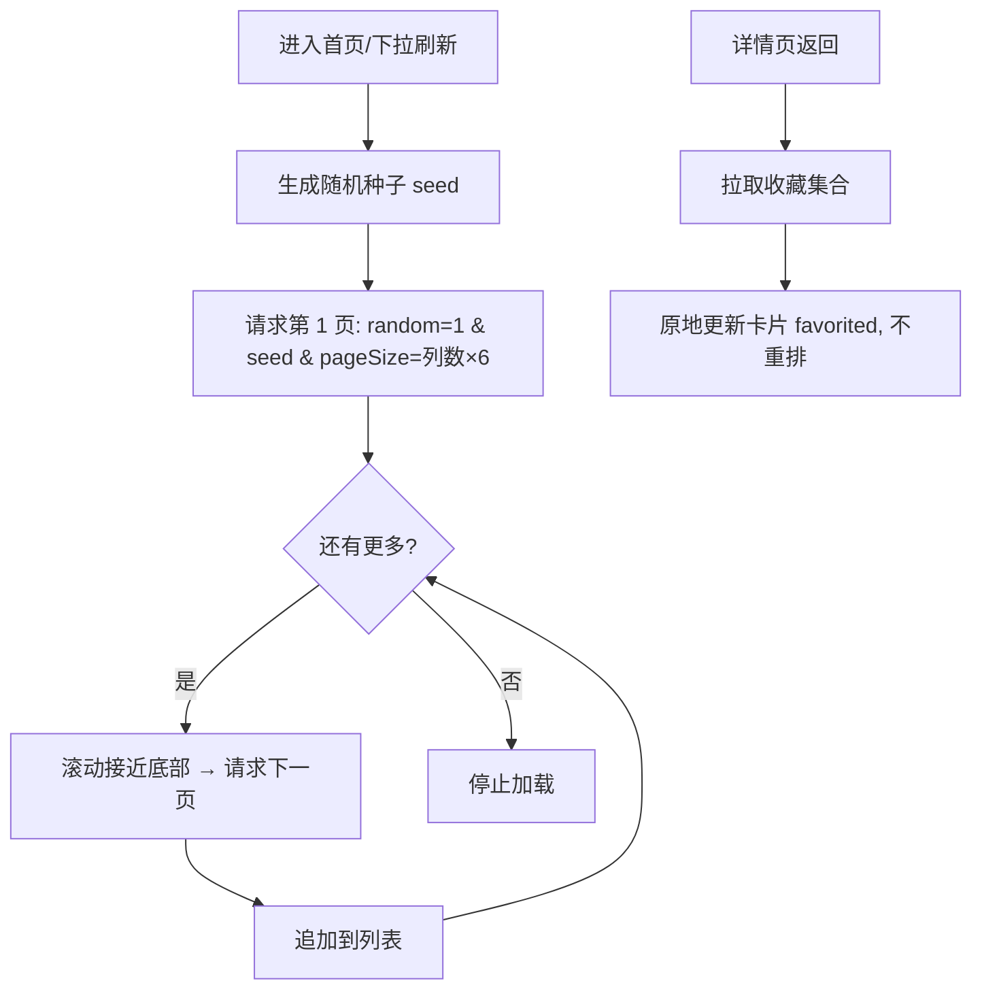

# 首页收藏角标、随机种子分页与悬浮续读条

## Summary

首页与搜索页卡片显示"已收藏"角标；首页随机网格改为种子分页（每页条数 = 列数 × 6，刷新换种子重排）；首页底部以悬浮"继续阅读"条取代顶部卡片。

---

## Problem Frame

首页随机网格一次拉取全库（pageSize=500），返回体大且不可扩展；收藏状态只在详情接口返回，列表卡片看不到；全量随机刷新即整体重排。"继续阅读"入口在顶部，占据首屏且与网格割裂。

---

## Requirements

承接 origin 的 R-ID，按能力分组；括号内为实现单元。

**收藏角标**

- R1. 列表接口返回每条漫画的 `favorited: boolean`。（U1）
- R2. 首页与搜索页卡片已收藏时在封面右上角显示红心角标。（U4, U5）
- R3. 角标为纯展示，点击角标不改变收藏状态。（U4, U5）
- R4. 从详情页返回后角标与最新状态一致，列表顺序与已加载内容不变。（U4, U5）

**随机种子分页**

- R5. 首页随机网格按随机种子稳定排序分页加载，滚动接近底部加载下一页。（U1, U3）
- R6. 进入首页或下拉刷新时生成新种子，重新洗牌。（U3）
- R7. 每页条数 = 当前列数 × 6，随窗口宽度变化调整。（U3）
- R8. 随机分页不出现重复或遗漏。（U1, U3）

**搜索页**

- R9. 搜索页沿用关键字分页，结果卡片同样显示收藏角标。（U1, U5）

**悬浮续读条**

- R10. 首页有阅读记录时底部显示"继续阅读"悬浮条（封面、标题、"第 X 话 · 第 Y 页"）。（U6）
- R11. 悬浮条左右与底部留间距，手机端位于底部导航上方。（U6）
- R12. 无记录不显示，不提供手动关闭。（U6）
- R13. 点击悬浮条直接进入阅读器并定位。（U6）
- R14. 只在首页出现。（U6）
- R15. 网格滚动内容不被悬浮条遮挡。（U6）
- R16. 首页顶部"最近阅读"卡片移除，由悬浮条取代。（U6）

---

## Key Technical Decisions

- **种子随机分页。** 后端列表接口在 `random=1` 时支持 `seed` 参数，用 `ORDER BY RAND(seed)` 保证同一种子下顺序稳定，配合 offset 分页不重复不漏；前端每次进入/刷新生成新种子。
- **动态页大小。** 每页条数 = 当前列数 × 6，由首页在请求时按 `comicGridColumns` 计算并传给接口；搜索页维持固定 30。
- **角标纯展示 + 原地同步。** 卡片角标只读；从详情页返回后，前端拉取收藏集合，仅更新本地卡片的 `favorited` 标志，不重排列表、不丢失已加载内容。
- **悬浮条取代顶部卡片。** 首页顶部卡片移除；悬浮条作为首页底部的 Stack 浮层，网格在有条时预留底部空间。

---

## High-Level Technical Design

首页随机网格的数据流：

---

## Implementation Units

### U1. 后端：列表接口 favorited + seed 稳定随机分页

- **Goal:** 列表接口返回每本收藏状态，并在 `random=1` 时支持种子稳定随机分页。
- **Requirements:** R1, R5, R8, R9
- **Dependencies:** 无
- **Files:** `backend/src/routes/comics.ts`
- **Approach:**
  - `comicQuery()` 增加 `favorited` 布尔字段：left join `favorites`，用 `CASE WHEN favorites.comic_id IS NOT NULL THEN 1 ELSE 0 END`（或 count 聚合）。
  - 列表接口读取 `seed` 参数：`random=1` 且有合法数值 seed 时用 `ORDER BY RAND(seed)`，无 seed 时维持 `ORDER BY RAND()`；offset 分页逻辑不变。
- **Patterns to follow:** 现有 `comicQuery()` 与 `ok`/`fail` 包装。
- **Verification:** 同一 seed 两次请求顺序一致、不同 seed 顺序不同；收藏后列表返回 `favorited: true`。

### U2. 前端数据层：Comic.favorited + 种子分页 API

- **Goal:** `Comic` 模型携带收藏状态；`ApiService` 支持种子分页请求。
- **Requirements:** R1, R5, R7
- **Dependencies:** U1
- **Files:** `lib/models/comic.dart`, `lib/services/api.dart`
- **Approach:**
  - `Comic` 增加 `favorited` 字段，`fromJson` 读取 `j['favorited'] == true`。
  - `getComics` 增加可选 `seed` 参数（拼接到查询串）；新增"按种子取随机页"的方法：`getRandomPage(seed, pageOffset, pageSize)` 返回 `(list, total)`。
- **Verification:** 能正确解析 favorited；分页请求带 seed 且返回 total。

### U3. 首页：随机种子分页 + 动态页大小

- **Goal:** 首页随机网格改为种子分页：滚动加载、刷新换种子、页大小 = 列数 × 6。
- **Requirements:** R5, R6, R7, R8
- **Dependencies:** U2
- **Files:** `lib/screens/home_screen.dart`
- **Approach:**
  - 状态增加 `_seed`（进入/刷新时用 `Random()` 生成）、`_pageOffset`、`_total`；随机模式按页追加，`_comics.length >= _total` 时停止。
  - 页大小在请求时计算：`comicGridColumns(可用宽度) * 6`。
  - 滚动监听在随机模式下接近底部时加载下一页；下拉刷新生成新种子并重置列表。
  - 搜索模式维持现有关键字分页。
- **Verification:** 连续滚动到底加载完 154 本无重复；刷新后顺序变化；窗口宽度变化后下一页大小随之变化。

### U4. 卡片收藏角标 + 详情返回同步（首页）

- **Goal:** 首页卡片显示红心角标；从详情页返回后原地同步收藏状态。
- **Requirements:** R2, R3, R4
- **Dependencies:** U2, U3
- **Files:** `lib/widgets/comic_card.dart`, `lib/screens/home_screen.dart`
- **Approach:**
  - `ComicCard` 在 `comic.favorited` 时于封面右上角叠加小红心（带半透明底）。
  - 首页从详情页返回后调用同步方法：拉取 `getFavorites` 得到收藏 id 集合，遍历 `_comics` 原地更新 `favorited`（列表对象需支持拷贝更新，或把 `favorited` 存为可变状态由卡片读取——实现时选更简者）。
- **Verification:** 收藏的漫画卡片显示红心；详情页取消收藏返回后角标消失且列表顺序不变。

### U5. 搜索页角标 + 返回同步

- **Goal:** 搜索结果卡片显示收藏角标，返回时同步状态。
- **Requirements:** R2, R3, R4, R9
- **Dependencies:** U1, U2
- **Files:** `lib/screens/search_screen.dart`
- **Approach:** 结果解析自带 `favorited`（U1）；从详情页返回后复用与首页相同的收藏集合原地同步逻辑。
- **Verification:** 搜索结果的收藏漫画显示红心；详情取消收藏返回后同步。

### U6. 首页底部悬浮续读条

- **Goal:** 移除顶部"最近阅读"卡片，改为底部悬浮条；网格预留底部空间。
- **Requirements:** R10–R16
- **Dependencies:** U3
- **Files:** `lib/screens/home_screen.dart`, `lib/widgets/comic_grid.dart`
- **Approach:**
  - 首页 body 改为 Stack：`ComicGrid` + 底部 `Positioned` 悬浮条（左右/底部 16px，封面缩略图 + 标题 + "第 X 话 · 第 Y 页"，点击进阅读器定位）。
  - 删除顶部 `_ContinueCard`；`ComicGrid` 增加可选 `bottomPadding`，有条时传入以预留空间。
  - 手机端悬浮条位于 HomeScreen 底部（即底部导航上方）；桌面端位于内容区底部。
- **Verification:** 有记录时底部出现悬浮条、顶部无卡片；无记录不显示；滚动到底最后一排卡片不被遮挡。

---

## Scope Boundaries

Deferred to Follow-Up Work:

- 点击角标切换收藏、角标出现在"我的"列表
- 搜索页分页动态化
- 悬浮条样式定制、手动关闭、多本轮换

Outside this round:

- 不改变搜索页关键字分页策略

---

## Risks & Dependencies

- 种子随机分页依赖后端 `RAND(seed)` 在 MySQL 的确定性（同一 seed 结果稳定，MySQL 保证）。
- 收藏角标同步依赖 `GET /api/mine/favorites`；返回详情页时先等待该请求完成再更新，避免角标闪烁。
- 悬浮条与网格底部预留空间需一起调整，避免遮挡。
- 构建门禁照旧：`flutter analyze` / `flutter test` / 后端 `tsc build`。

---

## Spec Impact

- `specs/comics-browsing.spec.md`（更新）：列表接口返回 `favorited`、支持 `seed` 稳定随机分页；首页随机分页与动态页大小契约。
- `specs/app-shell.spec.md`（更新）：首页卡片收藏角标、底部悬浮"继续阅读"条取代顶部卡片。
- `specs/reading-history-and-favorites.spec.md`（更新）：收藏状态进入列表接口（`favorited` 字段）。
