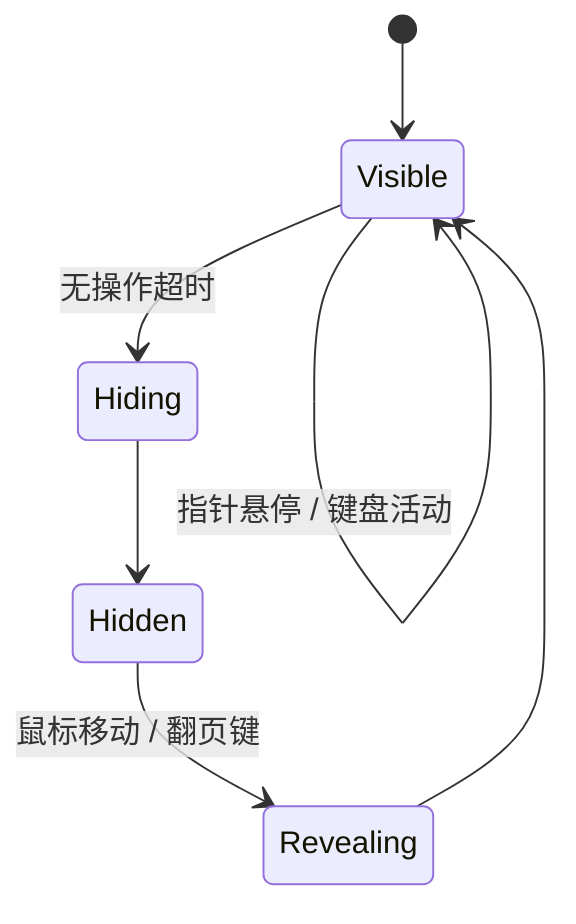

# 桌面阅读器体验优化（键盘 / 沉浸 / 过渡 / 图片重试）

## Summary

在桌面阅读形态上实现键盘翻页、沉浸式隐藏工具栏、翻页淡入过渡与图片失败重试，移动端行为保持不变，不触碰接口与数据层。改动集中在阅读器一个模块。

## Problem Frame

现有桌面阅读只有滚轮翻页，键盘与触控板用户缺少快捷路径；工具栏常驻分散注意力；翻页是硬切换；图片失败后只有静态占位与空态，没有恢复入口。四项都是纯前端体验缺口，无数据层依赖。

## Requirements

**键盘翻页**

- R1. 桌面形态支持 ←/→、空格、PageUp/PageDown 翻页；Home 跳本章第一页，End 跳本章最后一页。
- R2. 键盘翻页复用现有翻页语义：首/末页越界时沿用现有"回上一章 / 自动续章 / 续书"规则，不引入新行为。

**沉浸模式**

- R3. 桌面形态在无操作一段时间后自动隐藏 AppBar 与进度条，隐藏期间通过移动鼠标或按键恢复。
- R4. 隐藏与恢复都带平滑过渡；恢复后功能与当前一致，阅读位置不因隐藏变化。
- R5. 鼠标或键盘活动会重置隐藏计时；指针停留在工具栏区域时保持显示。

**翻页过渡**

- R6. 桌面单页切换以短促淡入淡出过渡，目标页未加载时保持现有加载/失败表现。
- R7. 快速连续翻页不排队动画，最终始终显示最新目标页。

**图片失败重试**

- R8. 单张图片加载失败显示可点击重试的失败态，重试失败后仍可再次重试。
- R9. 整章图片加载失败或为空时，桌面与移动端均提供重试入口重新拉取；重试仍失败时给出明确提示，不静默显示空态。

## Key Technical Decisions

- **键盘通过应用级焦点快捷方式处理，且仅在桌面形态启用**：复用 Flutter 标准的焦点/快捷键机制，避免原始按键监听与系统输入冲突，移动端完全不受影响。
- **沉浸隐藏只影响工具栏可见性，不改变布局与阅读状态**：无操作计时器驱动 AppBar 与进度条淡出，鼠标移动或翻页键恢复；隐藏期间阅读位置、滚轮与键盘行为保持可用。
- **过渡采用"目标页立即替换 + 短促淡入"**：不排队动画，快速连翻时每次都是最新页，避免旧页闪烁。
- **重试以重新加载实现**：单图点击失败态即重载该图，必要时先清理该 URL 的图片缓存；章节失败与"真没有图"分开显示，均有重试入口。

## High-Level Technical Design

键盘映射固定为通用阅读键位：

| 按键 | 行为 |
| --- | --- |
| ← / PageUp | 上一页；页首时回上一章 |
| → / PageDown / 空格 | 下一页；末页时续章/续书 |
| Home / End | 本章第一页 / 最后一页 |

沉浸显示是一个小的可见性状态机：

## Implementation Units

### U1. ✅ 键盘翻页

- **Goal:** 桌面形态可用键盘完成翻页、章内首尾直达，边界语义与滚轮一致。
- **Requirements:** R1, R2
- **Dependencies:** 无
- **Files:** `lib/screens/reader_screen.dart`
- **Approach:** 在桌面分页主体外包一层焦点快捷键处理，把各键映射到现有翻页方法；边界行为直接复用现有"回上一章 / 自动续章 / 续书"路径。
- **Verification:** 桌面按 ←/→/空格/PageUp/PageDown/Home/End 行为正确；首末页越界续章/续书不变；移动端无任何变化。

### U2. ✅ 沉浸式工具栏

- **Goal:** 桌面阅读时工具栏无操作自动隐藏，交互恢复，功能不因隐藏而改变。
- **Requirements:** R3, R4, R5
- **Dependencies:** 无
- **Files:** `lib/screens/reader_screen.dart`
- **Approach:** 用无操作计时器驱动 AppBar 与底部进度条的淡出/恢复；鼠标移动与翻页键触发恢复并重置计时；指针悬停于可见工具栏时保持显示；计时器随页面销毁清理。
- **Verification:** 静止数秒后工具栏淡出；移动鼠标恢复；隐藏期间滚轮与键盘翻页正常；离开页面无计时器残留。

### U3. 翻页过渡

- **Goal:** 桌面单页切换有短促淡入过渡，快速连翻不排队、不闪烁。
- **Requirements:** R6, R7
- **Dependencies:** U2（同一布局区域，先于 U3 落地减少冲突）
- **Files:** `lib/screens/reader_screen.dart`
- **Approach:** 桌面单页容器以"当前页键控重建 + 淡入"实现过渡；加载中与失败占位沿用现有表现。
- **Verification:** 单次翻页有淡入；按住 → 连续翻页始终显示最新页且无排队动画。

### U4. 图片失败重试

- **Goal:** 单图失败可点击重载；章节加载失败/为空有明确的重试入口与提示，桌面与移动端都覆盖。
- **Requirements:** R8, R9
- **Dependencies:** 无
- **Files:** `lib/screens/reader_screen.dart`
- **Approach:** 单图失败态改为可点击重载（必要时先清理该 URL 缓存）；章节加载失败与空章分开显示，分别提供重试按钮复用现有加载路径。
- **Verification:** 断网打开章节看到章节级重试，恢复网络后重试成功；单图失败点击后重载成功；空章显示空态与重试，而非静默空白。

## Acceptance Examples

- AE1. 桌面打开章节，静止数秒后工具栏淡出；移动鼠标后恢复显示；继续按 → 翻页正常。Covers R3–R5。
- AE2. 断网打开章节看到章节级重试；恢复网络后点击重试，图片正常加载。Covers R9。
- AE3. 桌面按 → 翻到本章末页后再按，自动进入下一章；发现模式进入时切到下一本漫画。Covers R2。
- AE4. 单图加载失败显示失败占位，点击后该图重载成功。Covers R8。

## Scope Boundaries

**Deferred to Follow-Up Work**

- 移动端点按翻页与工具栏隐藏、双指缩放、双页/宽屏模式、系统级全屏、章间无缝滚动衔接、预加载下一章首页、contain/铺满切换。

## Risks & Dependencies

- 隐藏计时器与页面生命周期相关：需随路由销毁清理，避免对 PopScope 的进度保存造成干扰。
- 图片重试依赖 Flutter 图片缓存：重试前清理失败 URL 的缓存项，避免旧失败态被直接复用。

## Spec Impact

- `specs/reader.spec.md` — updated：Public Contract 增加桌面键盘翻页、沉浸工具栏、翻页过渡与图片失败重试的行为；Notes 补充"失败可点击重试、快速翻页不排队"的设计意图。
