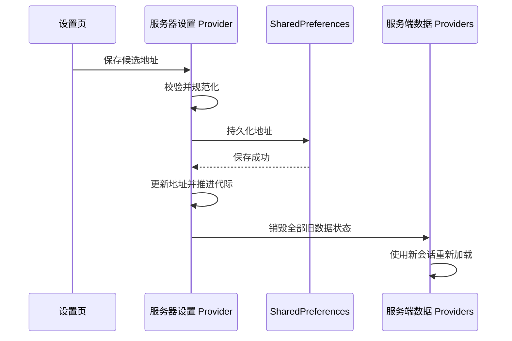
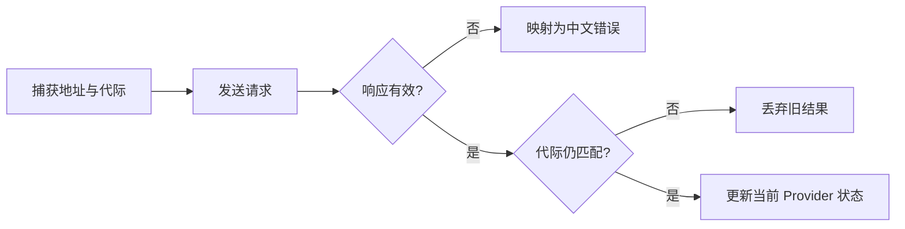

# feat: 支持配置漫画服务器地址

## Summary

把漫画服务器地址从编译期常量提升为可持久化的数据源会话。统一请求管线、资源 URL 和 Riverpod 状态都绑定到同一地址与代际；设置页负责测试候选地址和原子切换数据源。

---

## Problem Frame

当前 API、封面和章节图片都直接依赖固定地址，请求也缺少统一的超时、状态和响应校验。仅增加输入框会留下两个严重问题：切换后仍展示旧服务器缓存，以及切换前的异步请求晚到后污染新会话。

---

## Requirements

- R1. 服务器地址可校验、规范化、持久化并在启动首个请求前恢复。
- R2. 测试连接使用候选地址且不切换当前数据源；测试失败仍允许保存。
- R3. 所有漫画 API 请求共享 15 秒超时、HTTP 状态、JSON 结构和业务错误处理。
- R4. 保存不同地址后立即清除全部旧服务端状态并重新加载当前数据源。
- R5. 查询和 mutation 都必须隔离切换前的晚到结果。
- R6. 封面与章节图片 URL 固定绑定产生该响应的服务器地址。
- R7. 网络和响应错误使用稳定、可重试的中文提示。
- R8. 更新清单、主题、窗口设置和后端配置不受影响。

---

## Key Technical Decisions

- **地址只接受 origin。** 允许 `http`/`https`、主机与可选端口；拒绝 user-info、路径前缀、查询和 fragment，保存时移除空白与尾斜杠。
- **数据源会话携带单调代际。** 地址真正变化时才推进代际；请求开始时捕获会话，响应写入状态前确认代际仍匹配。
- **持久化先于运行时切换。** 本地保存失败时保持原地址和旧会话，避免本次运行与重启后的地址不一致。
- **服务实例由当前会话派生。** API provider 监听服务器会话；查询 provider 监听服务实例，mutation 捕获实例与代际。
- **切换是缓存优先规则的例外。** 保存新地址后显式销毁所有服务端 provider，不能以旧数据作为加载失败的后备。
- **资源地址在反序列化时绑定。** 模型保存响应所属服务器地址；切换后通过重新获取模型生成新 URL，不动态改写旧模型。
- **健康检查严格匹配现有协议。** 测试要求成功 HTTP、标准业务 envelope 和 `data.status == "ok"`；服务身份与协议版本留待后续。
- **设置页不直接访问服务。** 测试与保存由 provider/helper 暴露，遵守现有数据层约定。

---

## High-Level Technical Design

### 数据源切换

### 请求与晚到结果隔离

### 错误分类

| 情况 | 用户结果 |
|---|---|
| 地址不符合 origin 规则 | 地址格式无效 |
| DNS、拒绝连接或普通网络失败 | 无法连接服务器 |
| 超过 15 秒 | 请求超时 |
| TLS 握手或证书失败 | 无法建立安全连接 |
| HTTP 4xx / 业务拒绝 | 服务器拒绝请求，优先保留业务消息 |
| HTTP 5xx | 服务器内部错误 |
| 非 JSON 或 envelope 不完整 | 服务器响应异常 |

---

## Implementation Units

### U1. ✅ 服务器会话与统一请求管线

**Goal:** 建立可持久化的服务器会话、候选地址测试和一致的网络错误语义。

**Requirements:** R1、R2、R3、R7、R8。

**Dependencies:** 无。

**Files:** `app/lib/config.dart`、`app/lib/services/api.dart`、`app/lib/providers/server_provider.dart`、`app/lib/utils/user_error.dart`、`app/lib/main.dart`、`app/test/api_service_test.dart`、`app/test/server_provider_test.dart`。

**Approach:** 保留当前地址作为默认值；新增地址规范化、服务器会话和启动恢复。将 API 改为绑定不可变会话的实例，所有方法经统一请求入口；健康检查使用候选服务实例且不改当前状态。API 客户端允许受控注入并在 provider 销毁时释放，以覆盖协议与错误边界而不影响生产调用。

**Patterns to follow:** 主题/托盘偏好的 `SharedPreferences` 启动注入模式，更新服务已有的超时与 HTTP 检查方式，后端标准响应 envelope。

**Test scenarios:** 合法的 localhost、IPv4、IPv6 与端口；非法 scheme、路径、查询、fragment 和 user-info；成功、业务失败、4xx、5xx、无效 JSON、结构异常、连接失败和超时；健康响应结构不匹配。

**Verification:** 首次请求使用已保存地址；测试连接不改变当前会话；所有漫画 API 方法共享相同超时与错误分类；更新服务地址保持独立。

### U2. ✅ 服务端状态与资源 URL 迁移

**Goal:** 让全部查询、mutation 和图片资源绑定当前服务器会话，并隔离数据源切换竞态。

**Requirements:** R4、R5、R6、R8。

**Dependencies:** U1。

**Files:** `app/lib/providers/comics_providers.dart`、`app/lib/providers/discovery_providers.dart`、`app/lib/providers/reader_providers.dart`、`app/lib/providers/server_data.dart`、`app/lib/models/comic.dart`、`app/lib/models/image_item.dart`、`app/lib/models/reading_progress_entry.dart`。

**Approach:** 所有服务端 provider 消费当前 API 实例。有状态查询和 mutation 捕获会话代际，异步完成后只在代际仍有效时更新 UI 或触发失效；服务器切换协调器销毁简单查询、全部 family 实例、首页/搜索分页和发现序列。模型反序列化接收响应所属地址并生成绝对资源 URL，保留章节图片版本参数。

**Patterns to follow:** `specs/data-layer.convention.md` 的 provider 边界和现有 mutation 失效矩阵；现有 `withFavorited` 原地更新列表语义。

**Verification:** 保存不同地址后旧列表立即消失，首页/发现重新建会话，搜索结果清空；旧查询或 mutation 晚到不更新新会话；新模型的封面和章节图片只访问新服务器。

### U3. 设置交互与中文错误呈现

**Goal:** 在统一设置页完成候选地址的编辑、测试和保存，并让现有错误态显示可操作的中文原因。

**Requirements:** R2、R4、R7。

**Dependencies:** U1、U2。

**Files:** `app/lib/screens/settings_screen.dart`、`app/lib/screens/home_screen.dart`、`app/lib/screens/search_screen.dart`、`app/lib/screens/discovery_screen.dart`、`app/lib/screens/detail_screen.dart`、`app/lib/screens/reader_screen.dart`、`app/lib/widgets/reading_lists.dart`。

**Approach:** 设置页新增遵循现有主题令牌的“服务器”区；输入变化清除旧测试结果，测试与保存分别防重复提交，晚到测试结果仅在仍对应当前输入时展示。保存相同地址不刷新；离线地址保存成功后明确提示尚未验证。现有 `StatusView`、SnackBar 与重试入口保留，只把泛化失败文案替换为统一用户消息。设置入口位于应用根页面，不尝试把旧详情或阅读器 ID 映射到新服务器。

**Patterns to follow:** 设置页现有分区卡片、按钮和状态展示；`StatusView` 错误态；`context.appColors` 主题令牌。

**Verification:** 桌面与手机使用同一设置；测试 A 后编辑 B 不显示 A 的结果；测试失败可以保存；保存离线地址后旧服务器内容不再显示；失败页面继续提供重试。

---

## Scope Boundaries

### Deferred to Follow-Up Work

- 健康接口增加稳定服务标识或 API 协议版本。
- 局域网自动发现、多服务器列表和地址历史。
- 自动重试、离线浏览和跨服务器数据迁移。

### Outside This Change

- 登录、权限、证书部署、后端监听地址和 CORS 调整。
- 更新清单地址配置。
- 跨服务器恢复当前漫画、章节或阅读进度；服务器 ID 不视为可互换。

---

## Risks & Dependencies

- Riverpod 的依赖重建可能保留上一份 `AsyncValue` 作为刷新态，因此数据源切换仍需显式销毁旧 provider，不能只依赖 watch 传播。
- 首页分页、搜索和发现的手动异步方法可能跨越切换边界，必须在状态写入前检查捕获的代际。
- `Comic.withFavorited` 必须保留响应所属服务器地址；章节图片 URL 拼接必须保留后端的查询版本。
- 本地偏好损坏时使用同一校验器回退默认地址，不能阻塞应用启动。

---

## Spec Impact

- `specs/settings.spec.md` — **updated**：记录服务器地址持久化、校验、独立测试、离线仍可保存与启动恢复。
- `specs/data-layer.convention.md` — **updated**：记录服务器会话依赖、数据源切换的完整失效与竞态隔离、统一请求错误语义。
- `specs/reader.spec.md` — **updated**：记录章节图片 URL 绑定响应所属服务器，数据源切换不复用旧资源。

