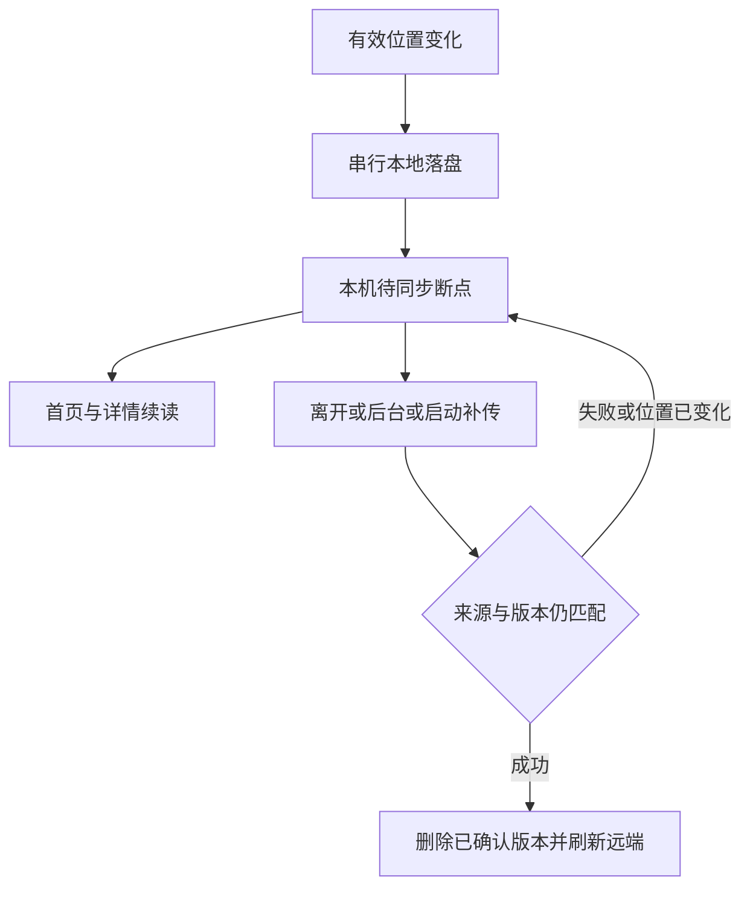

# 阅读进度本地兜底与失败补传

## 概述与需求

以现有单漫画单位置契约为基础，增加按服务器地址隔离的本地待同步队列。满足定义的 R1–R6，保留现有发现会话、移动定位和首页提示行为。

## 技术决策

- 待同步项保存规范化服务器地址、漫画展示元数据、章节标题、页码及单调版本。成功确认只删除相同版本；没有待同步项时远端权威。
- 原生端使用应用支持目录中的 JSON，写同目录临时文件并 flush 后替换主文件。Web 采用既有偏好存储适配。新增 path_provider，锁定解析后的依赖。
- 本地写入串行并只在写入成功后发布快照；网络同步串行，同会话并发请求合并，来源变化时终止旧批次的后续写入与查询失效。
- 本地展示叠加在现有远端查询之上，翻页更新不重新请求漫画详情或最近阅读。远端最近阅读失败时有本机项仍可展示。
- 阅读器捕获入口服务器和长期存活的队列，避免返回页面后的 WidgetRef 失效。应用级协调器负责启动、前台恢复和来源变化补传。
- Windows 原生退出和托盘关闭等待本地写入完成，不等待网络，避免断网退出卡住。

## 生命周期

## 实现单元

### U1. ✅ 本地队列与同步（同分支 PR 待创建）

- 文件：`app/lib/models/pending_reading_progress.dart`、`app/lib/services/progress_storage*.dart`、`app/lib/providers/reading_progress_provider.dart`、`app/pubspec.yaml`、`app/pubspec.lock`。
- 方案：平台存储、逐条反序列化容错、写入队列、版本确认与客户端会话隔离；保留原 API。
- 验证：失败重启恢复、版本竞争、来源切换、写入失败、原生临时文件替换与同会话同步互斥。

### U2. ✅ 阅读位置与生命周期（同分支 PR 待创建）

- 依赖：U1。
- 文件：`app/lib/screens/reader_screen.dart`、`app/lib/main.dart`、`app/lib/tray/close_to_tray*.dart`、`app/lib/providers/reader_providers.dart`。
- 方案：所有有效页码变化落盘；初始跳转抑制临时页码；退出和后台先写本地，捕获服务继续补传；章节请求代际防止晚到图片产生错误断点；原生关闭回调先完成本地写入。
- 验证：移动初始定位、连续换书、退出后仍补传、后台触发与翻页不发网络请求。

### U3. 续读与失败反馈

- 依赖：U2。
- 文件：`app/lib/screens/home_screen.dart`、`app/lib/screens/detail_screen.dart`、`app/lib/widgets/reading_lists.dart`、相关 `app/test/`。
- 方案：最近阅读合并当前来源待同步项；详情仅使用仍有效章节的待同步位置；阅读器提供本地待同步提示与手动重试。
- 验证：本机断点覆盖旧远端、源隔离、成功后远端重新成为权威、无额外翻页 GET 请求、失效章节回退。

## 风险与资料

- Flutter 生命周期不保证在强制结束前通知，因此不能仅靠退出保存（https://api.flutter.dev/flutter/dart-ui/AppLifecycleState.html）。
- shared_preferences 不保证返回时已落盘，原生端进度使用文件存储（https://pub.dev/packages/shared_preferences）。浏览器存储可被用户清理。
- path_provider 支持原生应用支持目录（https://pub.dev/packages/path_provider）。不改变平台构建最低版本要求。

## Spec Impact

- 更新 `specs/reading-history-and-favorites.spec.md`：待同步本机断点优先及补传时机，替换仅离开上报说明。
- 更新 `specs/reader.spec.md`：有效位置本地落盘、定位抑制、生命周期及失败恢复。
- 更新 `specs/data-layer.convention.md`：来源持久隔离、串行同步、版本确认与本地叠加查询。
- 检查 `specs/app-shell.spec.md`：保留已合并的首页续读提示规则，不恢复旧常驻行为。

