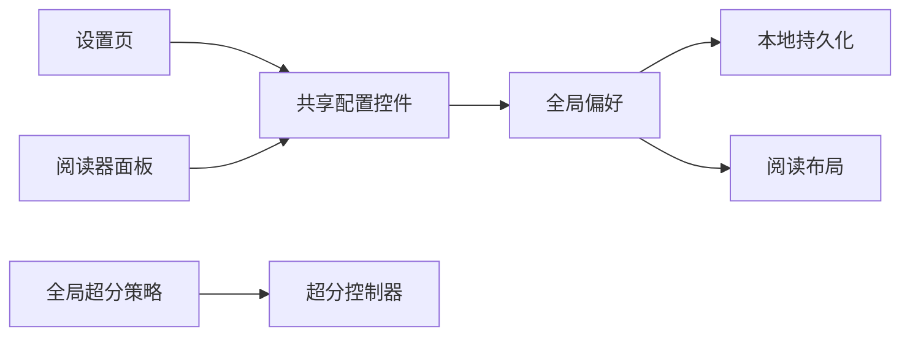

# 全局阅读配置实现计划

## 目标与边界

覆盖定义中的 R1–R7 与 AE1–AE4。沿用主题令牌、Riverpod 和本地偏好；不修改后端。

## 技术设计

共享阅读偏好启动恢复，串行持久化成功后发布快照。两处界面使用同一组选项与保存逻辑，设置页采用完整行布局，阅读器采用紧凑浮层或底部面板。

阅读页码始终为原图索引。双页从当前页起显示两张，窄屏回退单页；翻页按可见页数推进，最后奇数页不丢失。布局变更沿用定位代际，图片预加载与实际渲染共用适配尺寸。

## 实现单元

### U1：全局配置与自适应阅读器

状态：实现与门禁完成，PR #66。

- 依赖：无。
- 文件：app/lib/providers/settings_provider.dart、super_resolution_provider.dart、app/lib/main.dart、app/lib/widgets/reader_settings_controls.dart、app/lib/screens/settings_screen.dart、reader_screen.dart。
- 实现：持久化阅读偏好；两处同源控件；分页触摸操作、双页、方向、适配和背景；超分实时同步；保持断点、预加载和图片重试。
- 验证：扩展现有 reader_screen_test.dart 和 ui_layout_test.dart，覆盖共享配置、失败保留、移动端、大字体、分页及模式切换；执行仓库五项门禁。

## Spec Impact

- specs/reader.spec.md：全局模式、移动端分页、双页与沉浸行为。
- specs/settings.spec.md：共享全局阅读配置与持久化。
- specs/data-layer.convention.md：超分策略即时同步。
- specs/ui-style.convention.md：设置分组及阅读器自适应面板。
- specs/image-loading.convention.md：分页适配尺寸与双页缓存。
- specs/super-resolution.spec.md：超分由默认值改为实时共享全局策略。

## 风险

布局变化不能记录中间页或误触续章。新偏好损坏回退默认；写入串行，失败保留旧值。超分模式变更使旧请求代际失效而不重建阅读进度。
